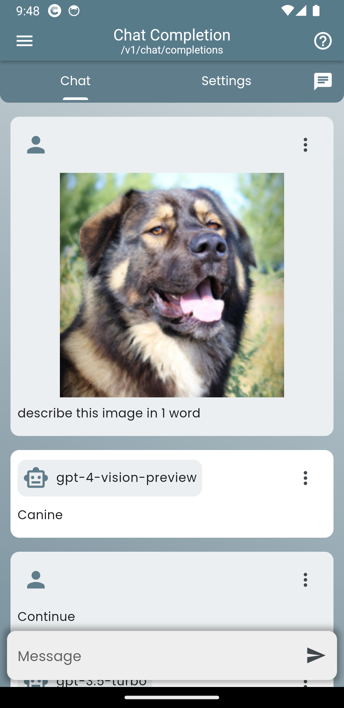
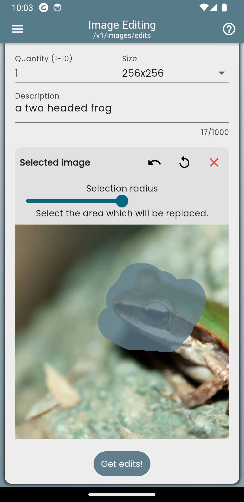
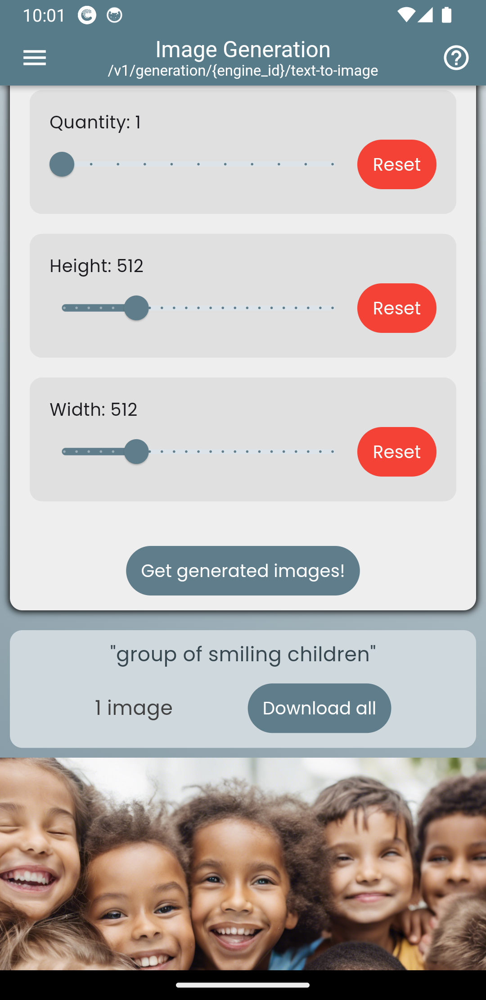
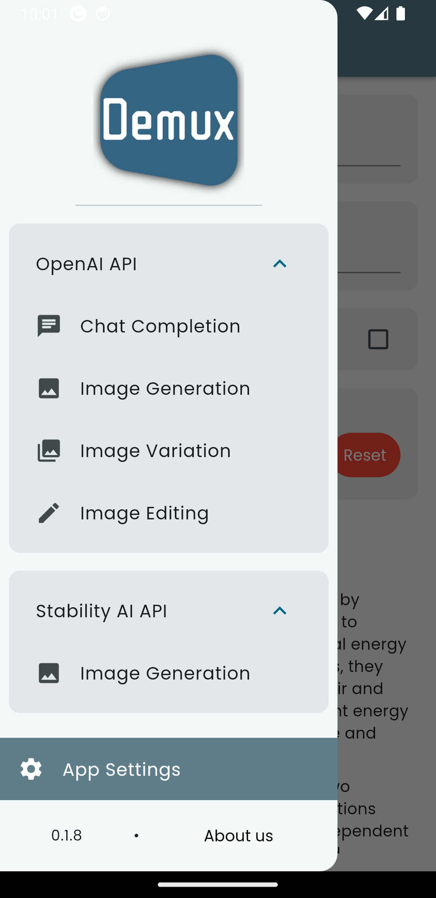

# Demux 📱🌐

Demux is a mobile and web client for AI APIs, implemented in Flutter. It provides a unified platform to access a wide range of AI features, including chat, image generation, image editing, and more, from multiple APIs. With Demux, you can fulfill all your AI needs in one convenient app.

## Features ✨

- 🤖 Chatbot with image support
- 🖼️ Image generation using OpenAI Dalle and Stability AI Stable Diffusion
- 🎨 Image editing capabilities
- 🔄 Image variation generation

## Screenshots 📸

  
  
  
  

## Live Demo 🌐

Check out the hosted version of Demux at [demux.app](https://demux.app) and experience the power of AI in your browser!

## Installation 💻

To get started with Demux, follow these steps:

1.  Install [fvm](https://fvm.app/) (Flutter Version Management)
2.  Install [Flutter](https://docs.flutter.dev/) by running `fvm install`
3.  Install dependencies by running `fvm flutter pub get`
4.  Run the app in either an emulator, physical device with USB cable, or web browser (use Visual Studio Code launch options as a template, may need to change deviceId to your own)

## Usage 🚀

1.  Open the Demux app
2.  Navigate to the settings page
3.  Input your secret API keys for the desired AI services
4.  Start exploring and using the app's features!

## Contributing 🤝

We welcome contributions from the community! If you'd like to contribute to Demux, please feel free to open issues and submit pull requests.

## License 📄

Demux is released under the [GNU General Public License](COPYING).

## Contact 📧

If you have any questions, suggestions, or feedback, please feel free to reach out to us:

- Email: [gabriel@desidera.dev](mailto:gabriel@desidera.dev)
- LinkedIn: [Gabriel Desiderá](https://www.linkedin.com/in/gabriel-marton-desider%C3%A1-9083b314a/)
- GitHub: [Gyarados](https://github.com/Gyarados)

## Roadmap 🗺️

Here's a glimpse of our planned features and improvements for Demux:

- [ ] Integration with additional AI APIs
- [ ] Audio interface
- [ ] Enhanced user customization options

Leave a star and stay tuned for more exciting updates! 🎉
